# Triumph of Anytown - Motorcycle Dealership Website

A responsive, modern website for Triumph of Anytown motorcycle dealership built with HTML, CSS, JavaScript, and Bootstrap 3.

## 🏍️ Overview

Triumph of Anytown is a fully responsive dealership website showcasing motorcycle inventory, services, and company information. The site features a clean, professional design optimized for both desktop and mobile users interested in purchasing and servicing Triumph motorcycles.

## ✨ Features

### Responsive Design
- **Desktop**: Full-featured layout with side-by-side sections and comprehensive navigation
- **Tablet (1024px and below)**: Optimized layout with adjusted carousels, stacked sections, and tablet-specific navigation
- **Mobile**: Mobile-first approach with hamburger menus and single-column layouts

### Key Sections
- **Header & Navigation**: Responsive header with contact info, social links, and adaptive navigation
- **Hero Banner**: Eye-catching banner with search functionality and call-to-action buttons
- **Motorcycle Classes**: Showcase of 6 motorcycle categories (Adventure, Modern Classics, Motocross, Roadsters, Rocket 3, Sport)
- **Featured Vehicles**: Carousel display of new and used motorcycles with pricing and details
- **Promotions & Events**: Collapsible sections for current deals and upcoming events
- **Our Team**: Staff introduction with interactive carousel
- **Customer Reviews**: Google reviews integration with rating system
- **Contact & Business Hours**: Comprehensive contact information and service hours
- **Footer**: Quick links, social media, and legal information

### Technical Features
- Bootstrap 3 framework for responsive grid system
- Custom carousels with touch/swipe support
- Font Awesome and Bootstrap icons
- Google Maps integration
- Social media integration
- SEO-optimized structure
- Cross-browser compatible

## 🛠️ Technologies Used

- **Frontend**: HTML5, CSS3, JavaScript (ES6+)
- **Framework**: Bootstrap 3.4.1
- **Icons**: Font Awesome, Bootstrap Icons
- **JavaScript Libraries**: jQuery 1.12.4
- **Fonts**: Poppins, Work Sans, Teko (Google Fonts)

## 🖼️ Desktop
  

    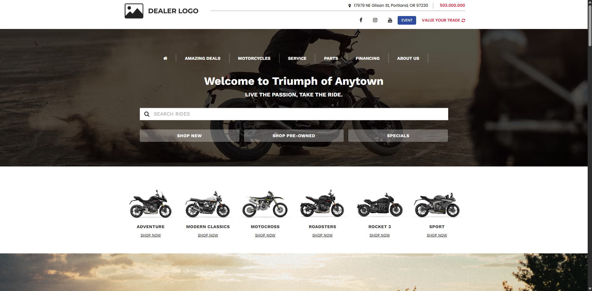
    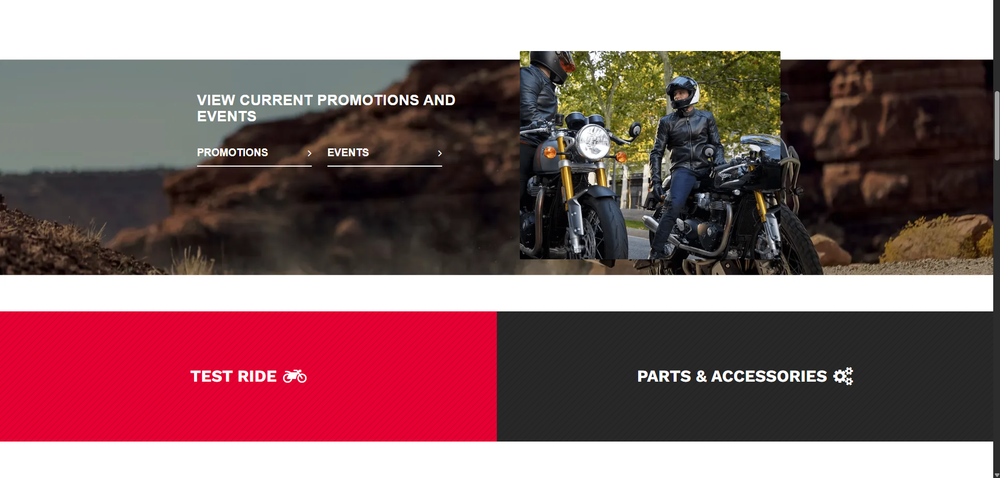
    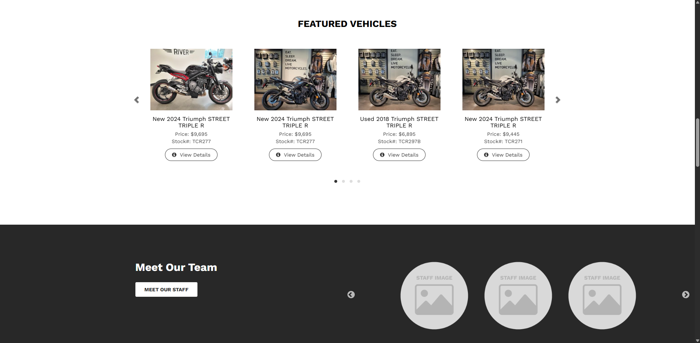
    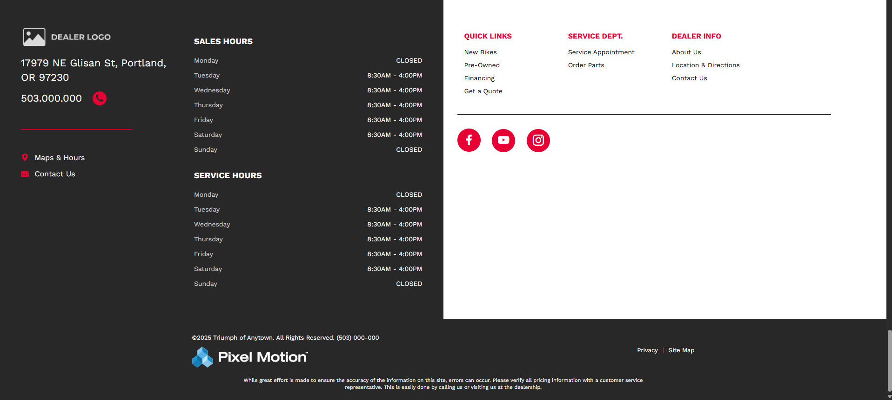
  

## 🖼️ Tablet
  

    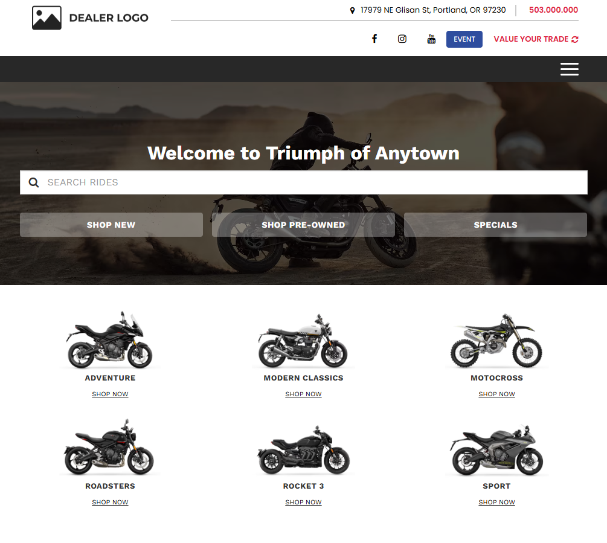
    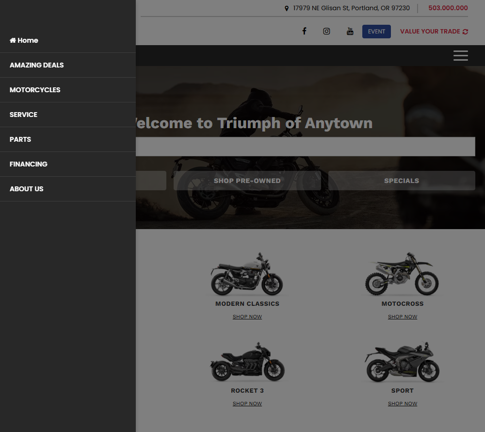
    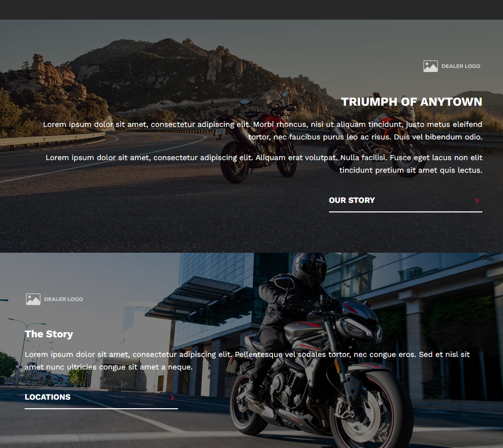
    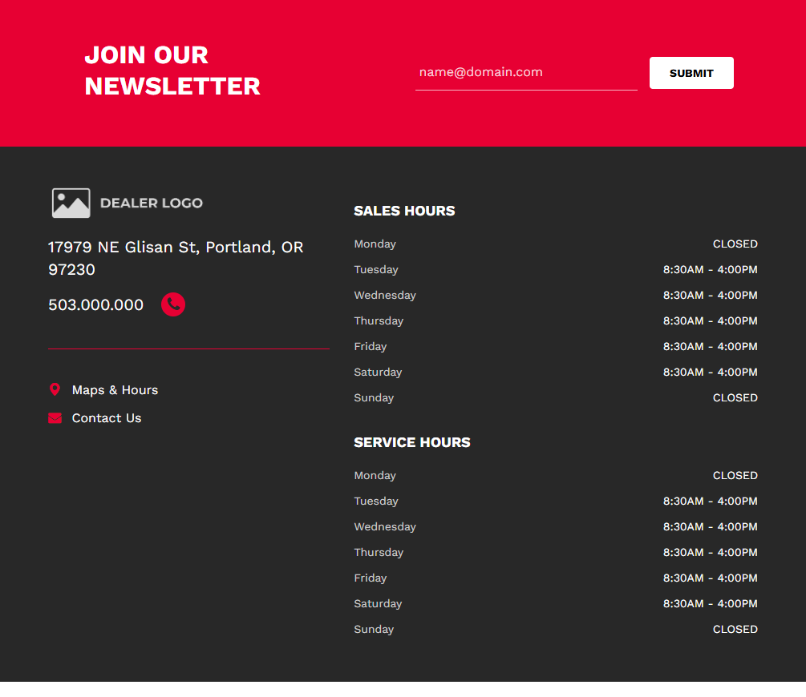
  

## 🖼️ Mobile Phone
  

    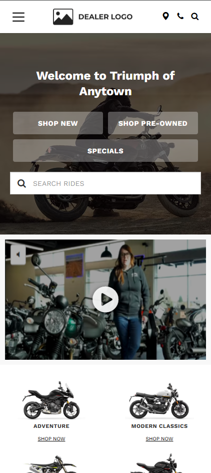
    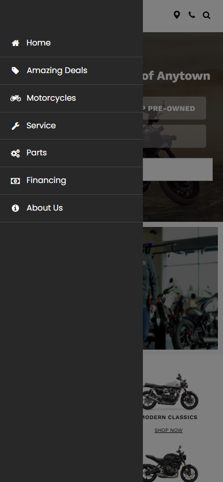
    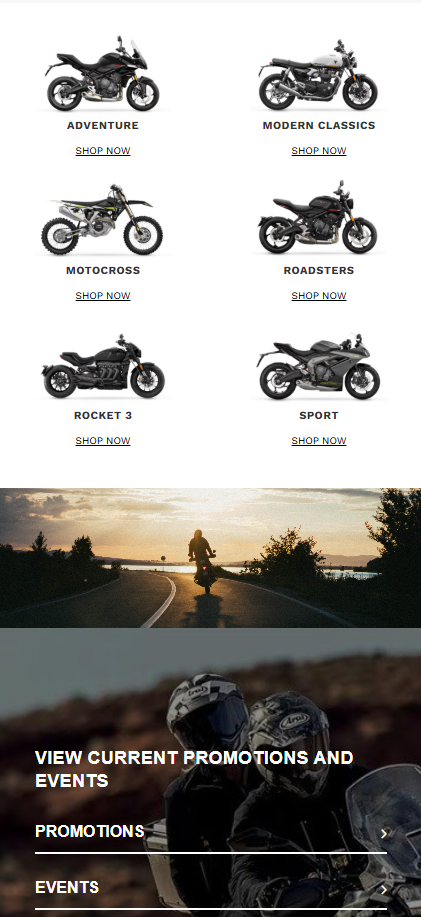
    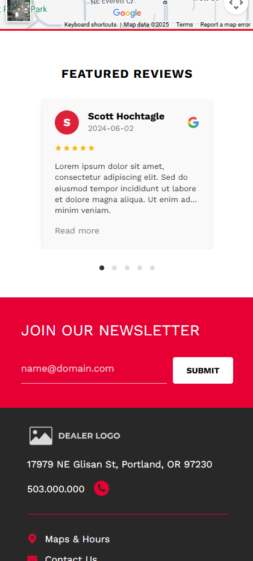
  

## 📱 Responsive Breakpoints

- **Desktop**
- **Tablet**
- **Mobile**

## 🎨 Design System

### Color Palette
- **Primary Red**: #EB1024, #DF203A, #E70033 (Brand accents, buttons, hover states)
- **Dark Background**: #282828 (Headers, footers, dark sections)
- **Light Background**: #FFFFFF (Main content areas)
- **Text**: #000000 (Primary), #333333 (Secondary), #FFFFFF (Light backgrounds)

### Typography
- **Headings**: Work Sans (Bold weights)
- **Body Text**: Poppins (Regular weights)
- **Special Headings**: Teko (Condensed style for impact)
